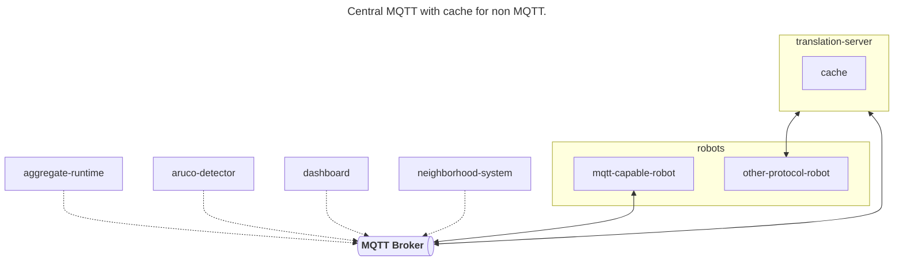
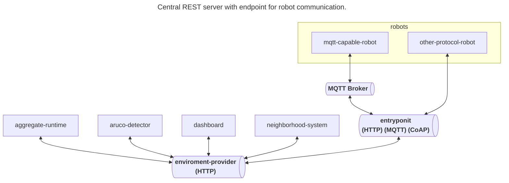
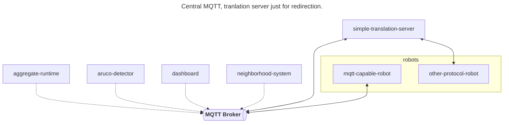
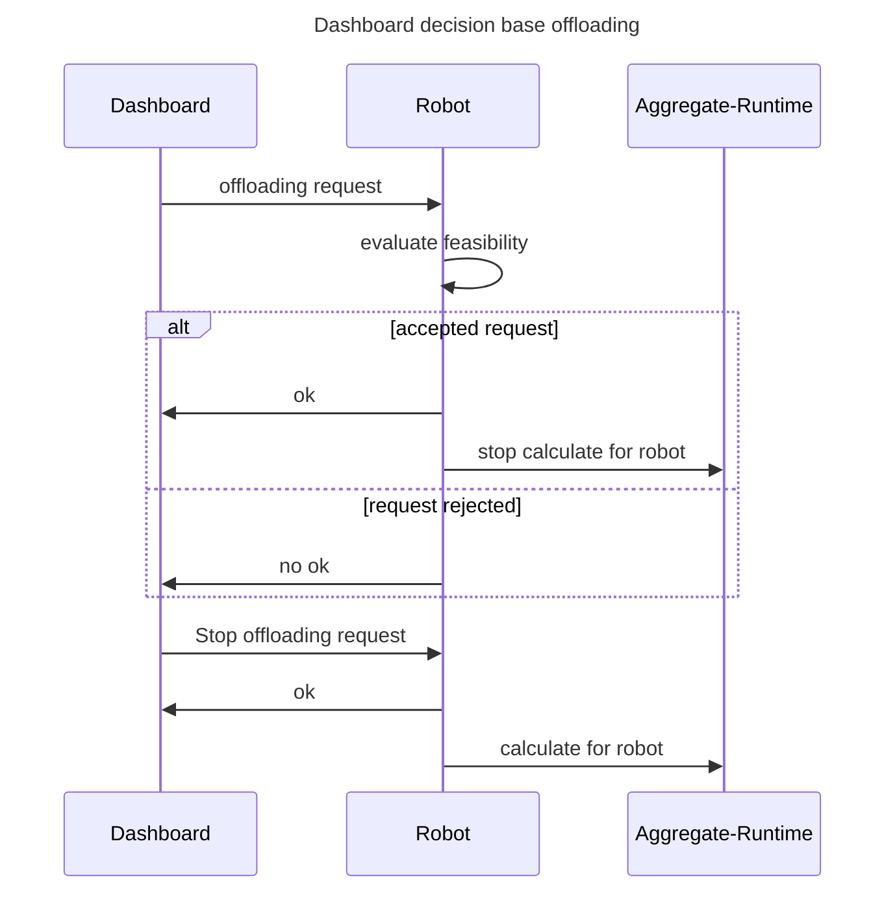
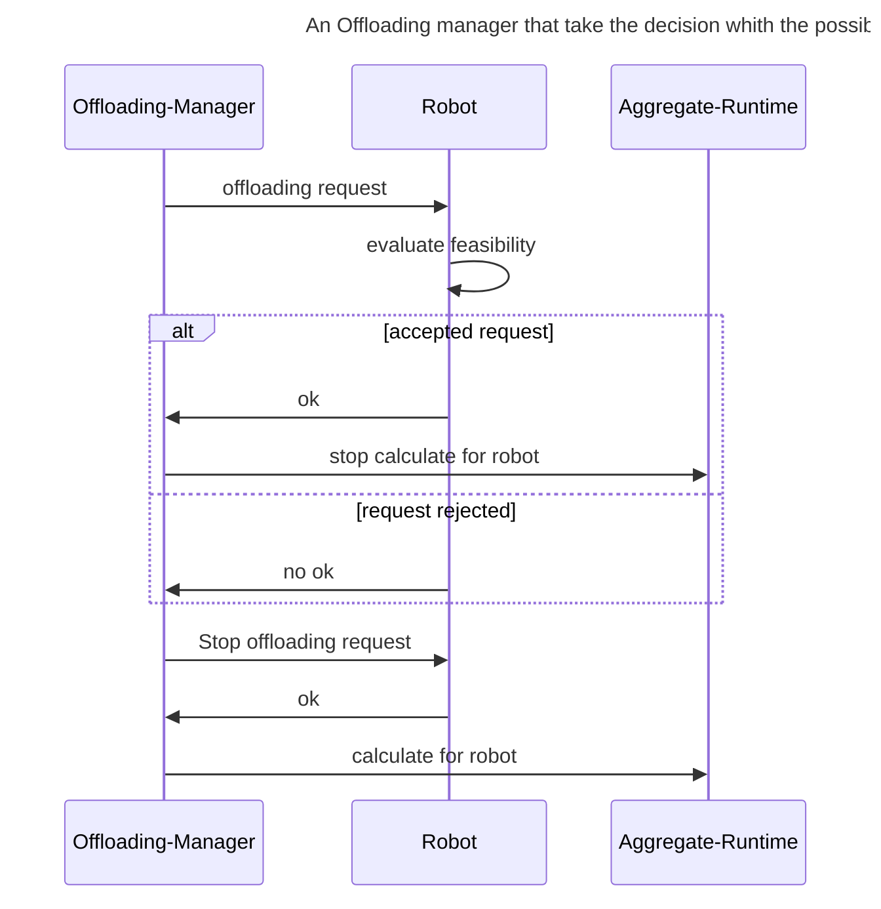

```mermaid
---
title: Central MQTT with cache for non MQTT.
---
graph 
  AR[aggregate-runtime]
  AD[aruco-detector]
  D[dashboard]
  NS[neighborhood-system]
  M@{ shape: das, label: "<b>MQTT Broker</b>" }

  AR -.-> M
  AD -.-> M
  D -.-> M
  NS -.-> M

  subgraph robots
    R1[mqtt-capable-robot]
    R2[other-protocol-robot]
  end 

  subgraph T[translation-server]
    C[cache]
  end

  T <-->R2
  T <--> M
  R1 <--> M
```

```mermaid
---
title: Central REST server with endpoint for robot communication.
---
graph 
  AR[aggregate-runtime]
  AD[aruco-detector]
  D[dashboard]
  NS[neighborhood-system]
  M@{ shape: das, label: "<b>MQTT Broker</b>" }
  
  subgraph robots
    R1[mqtt-capable-robot]
    R2[other-protocol-robot]
  end 
  E@{ shape: das, label: "<b>entryponit</b><br><b>(HTTP) (MQTT) (CoAP)</b>"}
  EP@{ shape: das, label: "<b>enviroment-provider</b><br><b>(HTTP)</b>"}

  AR <--> EP
  AD <--> EP
  D <--> EP
  NS <--> EP
  E <--> EP
  R1 <--> M
  M <--> E
  R2 <--> E
```

```mermaid
---
title: Central MQTT, tranlation server just for redirection.
---
graph 
  AR[aggregate-runtime]
  AD[aruco-detector]
  D[dashboard]
  NS[neighborhood-system]
  M@{ shape: das, label: "<b>MQTT Broker</b>" }

  AR -.-> M
  AD -.-> M
  D -.-> M
  NS -.-> M

  subgraph robots
    R1[mqtt-capable-robot]
    R2[other-protocol-robot]
  end 

  T[simple-translation-server]

  T <--> R2
  T <--> M
  R1 <--> M
```

```mermaid
---
title: Dashboard decision base offloading
---
sequenceDiagram
    Dashboard->>Robot: offloading request
    Robot->>Robot: evaluate feasibility 
    alt accepted request 
    Robot->>Dashboard: ok
    Robot->>Aggregate-Runtime: stop calculate for robot
    else request rejected
    Robot->>Dashboard: no ok
    end
    Dashboard->>Robot: Stop offloading request
    Robot->>Dashboard: ok
    Robot->>Aggregate-Runtime: calculate for robot


```

```mermaid
---
title: An Offloading manager that take the decision whith the possibility of a coresponsability of a dashboard
---
sequenceDiagram
    Offloading-Manager->>Robot: offloading request
    Robot->>Robot: evaluate feasibility 
    alt accepted request 
    Robot->>Offloading-Manager: ok
    Offloading-Manager->>Aggregate-Runtime: stop calculate for robot
    else request rejected
    Robot->>Offloading-Manager: no ok
    end
    Offloading-Manager->>Robot: Stop offloading request
    Robot->>Offloading-Manager: ok
    Offloading-Manager->>Aggregate-Runtime: calculate for robot
```